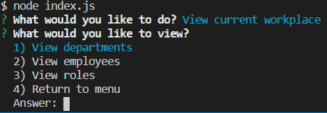

# Title

MySQL Employee Manager CLI Application

This application allows the user to add, remove, view, and correlate employees, roles, and departments.

# Installation

A live deployment is not available as this is designed as a CLI application

To use locally use the following steps.

<ol>
    <li>Download the files from Github.</li>
    <li>Install and setup MySQL with a localhost server.</li>
    <li>Open the downloaded files with VS code.</li>
    <li>Copy the employees.sql file, paste it into your MySQL, and execute to create a database.</li>
    <li>Run the command npm install in your terminal (To open: ctrl + `)</li>
    <li>Replace the data on lines 7 to 11 with your local MySQL server details</li>
    <li>Start with the command Node index.js in your terminal</li>
    <li>When finished, exit with Ctrl + C</li>
</ol>

## Built With
<ul>
<li>MySQL database software - Only installed by user</li>
<li>Node.js and the following packages</li>
<ul>
<li>Inquirer - Installed via Node</li>
<li>MySQL - Installed via Node</li>
</ul>
</ul>

## Code Overview

When the Node index.js command is executed, a link to the local MySQL software is created and if not possible an error will be displayed. The program will then run through multiple levels of if-else statements to prompt the user on what action they wish to do. Entered data from the user can be viewed or more can be created/edited each time by pulling from or adding to the MySQL database.
 